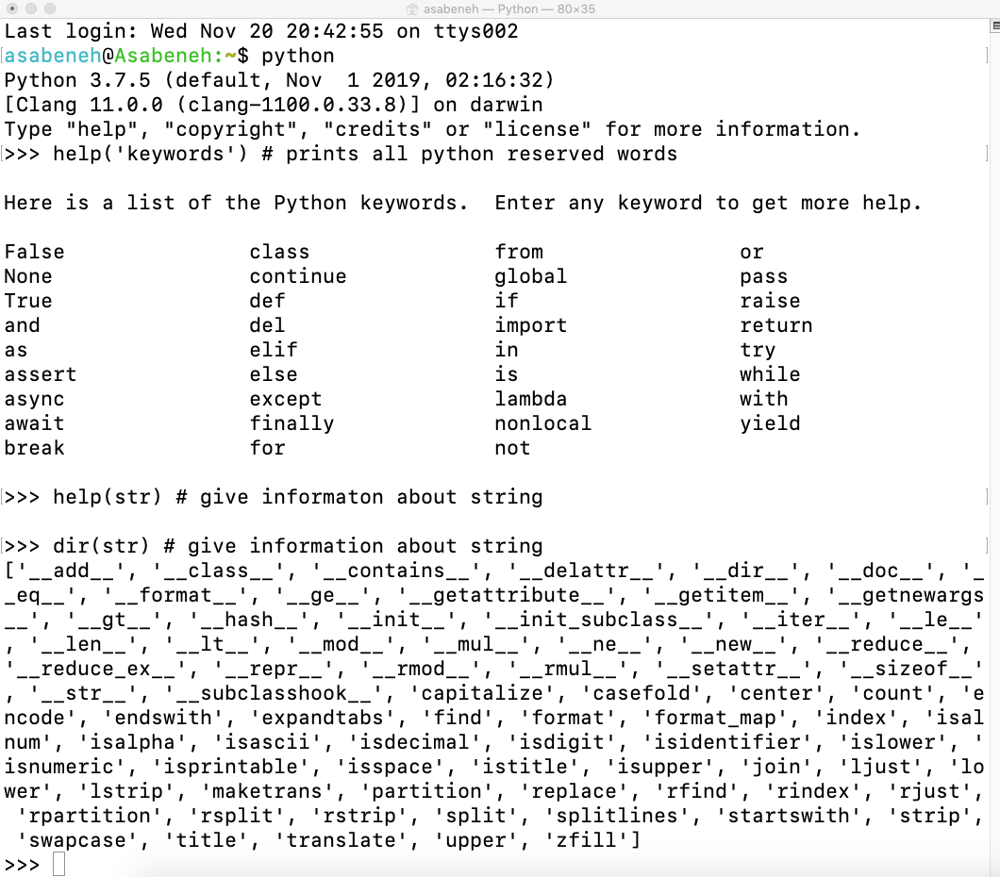

<div align="center">
  <h1> 30 天 Python：第二天 - 变量, 内置函数</h1>
  <a class="header-badge" target="_blank" href="https://www.linkedin.com/in/asabeneh/">
  
  </a>
  <a class="header-badge" target="_blank" href="https://twitter.com/Asabeneh">
  
  </a>

<sub>作者:
<a href="https://www.linkedin.com/in/asabeneh/" target="_blank">Asabeneh Yetayeh</a><br>
<small> 第二版：2021 年 7 月</small>
</sub>

</div>

[<< 第一天](./readme.md) | [第三天 >>](./03_operators.md)


_阅读大约需要：12m_

- [📘 第二天](#-第二天)
  - [内置函数](#内置函数)
  - [变量](#变量)
    - [在一行中声明多个变量](#在一行中声明多个变量)
  - [数据类型](#数据类型)
  - [数据类型转换](#数据类型转换)
  - [Numbers](#numbers)
  - [💻 练习 - 第二天](#-练习---第二天)
    - [练习： 1级](#练习-1级)
    - [练习： 2级](#练习-2级)

# 📘 第二天

## 内置函数

Python 提供了很多内置函数。内置函数是全局可用的，这意味着您可以在不导入或配置的情况下使用内置函数。以下是几种最常用的 Python 内置函数：_print()_, _len()_, _type()_, _int()_, _float()_, _str()_, _input()_, _list()_, _dict()_, _min()_, _max()_, _sum()_, _sorted()_, _open()_, _file()_, _help()_, _dir()_。在下表中，您将看到从 [Python 文档](https://docs.python.org/3.9/library/functions.html)中获取的详尽的 Python 内置函数列表。


让我们打开 Python shell 并开始使用一些最常见的内置函数。


使用不同的内置函数进行更多练习



如上所示，Python 有保留字。我们不能使用保留字来声明变量或函数。我们将在下一节中介绍变量。

我相信，现在您已经熟悉了内置函数。让我们再练习一下内置函数，然后我们继续下一节。


## 变量

变量将数据存储在计算机内存中。在许多编程语言中，建议使用助记符变量。助记符变量是一个易于记忆和关联的变量名。变量指的是存储数据的内存地址。

命名变量时，不允许以数字开头、使用特殊字符和连字符。变量可以有一个简短的名称（如 x、y、z），但强烈建议使用更具描述性的名称（名字、姓氏、年龄、国家/地区）。

Python 变量名规则

- 变量名必须以字母或下划线字符开头
- 变量名不能以数字开头
- 变量名只能包含字母数字字符和下划线（A-z、0-9 和 \_ ）
- 变量名区分大小写（firstname、Firstname、FirstName 和 FIRSTNAME 是不同的变量）

以下是一些有效变量名的示例：

```shell
firstname
lastname
age
country
city
first_name
last_name
capital_city
_if # 如果我们想使用保留字作为变量
year_2021
year2021
current_year_2021
birth_year
num1
num2
```

无效的变量名

```shell
first-name
first@name
first$name
num-1
1num
```
我们将使用许多 Python 开发人员采用的标准 Python 变量命名样式。Python 开发人员使用蛇形命名法 (snake_case) 变量命名约定。对于包含多个单词的变量，我们在每个单词后使用下划线（例如 first_name、last_name、engine_rotation_speed）。下面的示例是变量的标准命名示例，当变量名称超过一个单词时，需要使用下划线。

当我们将某种数据类型分配给变量时，这称为变量声明。例如，在下面的例子中，我的名字被分配给变量 first_name。等号是赋值运算符。赋值意味着将数据存储在变量中。Python 中的等号与数学中的等号不同。

_示例：_

```py
# Python 中的变量
first_name = 'Asabeneh'
last_name = 'Yetayeh'
country = 'Finland'
city = 'Helsinki'
age = 250
is_married = True
skills = ['HTML', 'CSS', 'JS', 'React', 'Python']
person_info = {
   'firstname':'Asabeneh',
   'lastname':'Yetayeh',
   'country':'Finland',
   'city':'Helsinki'
   }
```

让我们使用 _print()_ 和 _len()_ 内置函数。打印函数可以接受无限数量的参数。参数是一个值，我们可以将其传递或放在函数括号内，请参见下面的示例。

**示例：**

```py
print('Hello, World!') # The text Hello, World! is an argument
print('Hello',',', 'World','!') # it can take multiple arguments, four arguments have been passed
print(len('Hello, World!')) # it takes only one argument
```

让我们打印并算出在上面声明的变量的长度：


**示例：**

```py
# 打印变量的值

print('First name:', first_name)
print('First name length:', len(first_name))
print('Last name: ', last_name)
print('Last name length: ', len(last_name))
print('Country: ', country)
print('City: ', city)
print('Age: ', age)
print('Married: ', is_married)
print('Skills: ', skills)
print('Person information: ', person_info)
```

### 在一行中声明多个变量

多个变量也可以在同一行中声明：

**示例：**

```py
first_name, last_name, country, age, is_married = 'Asabeneh', 'Yetayeh', 'Helsink', 250, True

print(first_name, last_name, country, age, is_married)
print('First name:', first_name)
print('Last name: ', last_name)
print('Country: ', country)
print('Age: ', age)
print('Married: ', is_married)
```

使用内置函数 _input()_ 获取用户输入。让我们从用户那里得到的数据并赋值给 first_name 和 age 变量。
.
**示例：**

```py
first_name = input('What is your name: ')
age = input('How old are you? ')

print(first_name)
print(age)
```

## 数据类型

Python 中有多种数据类型。为了识别数据类型，我们使用 _type_ 内置函数。我想请您熟练掌握不同的数据类型。当涉及到编程时，一切都与数据类型有关。我在一开始就介绍了数据类型，现在又提到了，因为每个主题都与数据类型有关。我们将在数据类型各自的章节中做更详细的介绍。

## 数据类型转换

- 检查数据类型：为了检查某些数据/变量的数据类型，我们使用 _type_ 函数

  **示例：**

```py
# python 中不同的数据类型
# 声明一些有各种数据类型的变量

first_name = 'Asabeneh'     # str
last_name = 'Yetayeh'       # str
country = 'Finland'         # str
city= 'Helsinki'            # str
age = 250                   # int, 不用担心，这并不是我真实的年龄 :) 

# Printing out types
print(type('Asabeneh'))     # str
print(type(first_name))     # str
print(type(10))             # int
print(type(3.14))           # float
print(type(1 + 1j))         # complex
print(type(True))           # bool
print(type([1, 2, 3, 4]))     # list
print(type({'name':'Asabeneh','age':250, 'is_married':250}))    # dict
print(type((1,2)))                                              # tuple
print(type(zip([1,2],[3,4])))                                   # set
```

- 数据类型转换：将一种数据类型转换为另一种数据类型。我们使用 _int()_、_float()_、_str()_、_list_、_set_
当我们进行算术运算时，字符串数字应首先转换为 int 或 float，否则将返回错误。如果我们将数字与字符串连接起来，则应首先将数字转换为字符串。我们将在字符串部分讨论连接。


  **示例：**

```py
# 整型 到 浮点型
num_int = 10
print('num_int',num_int)         # 10
num_float = float(num_int)
print('num_float:', num_float)   # 10.0

# 浮点型 到 整型
gravity = 9.81
print(int(gravity))             # 9

# 整型 到 字符串
num_int = 10
print(num_int)                  # 10
num_str = str(num_int)
print(num_str)                  # '10'

# 字符串 到 整型或浮点型
num_str = '10.6'
print('num_int', int(num_str))      # 10
print('num_float', float(num_str))  # 10.6

# 字符串 到 列表
first_name = 'Asabeneh'
print(first_name)               # 'Asabeneh'
first_name_to_list = list(first_name)
print(first_name_to_list)            # ['A', 's', 'a', 'b', 'e', 'n', 'e', 'h']
```

## Number

Python 中不同的数字类型

- Integer：整型数字(负数, 0 以及 正数)
    示例：
    ... -3, -2, -1, 0, 1, 2, 3 ...
- Float：浮点数
    示例
    ... -3.5, -2.25, -1.0, 0.0, 1.1, 2.2, 3.5 ...
- Complex：复数
    示例
    1 + j, 2 + 4j, 1 - 1j

🌕 你太棒了。你刚刚完成了第 2 天的挑战，在通往成功的路上又前进了一步。现在做一些练习来锻练你的大脑和肌肉。


## 💻 练习 - 第二天

### 练习： 1级

1. 在 30DaysOfPython 文件夹内创建一个 day_2 文件夹。在这个文件夹里创建一个 variables.py 文件
2. 输入注释 '第二天： 30 Days of python programming'
3. 声明一个 first name 变量，并为它赋值
4. 声明一个 last name 变量，并为它赋值
5. 声明一个 full name 变量，并为它赋值
6. 声明一个 country 变量，并为它赋值
7. 声明一个 city 变量，并为它赋值
8. 声明一个 age 变量，并为它赋值
9. 声明一个 year 变量，并为它赋值
10. 声明一个 is_married 变量，并为它赋值
11. 声明一个 is_true 变量，并为它赋值
12. 声明一个 is_light_on 变量，并为它赋值
13. 在一行中声明多个变量

### 练习： 2级

1. 使用 _type()_ 内置函数检查你声明变量的数据类型
1. 使用 _len()_ 内置函数，算出你 first name 变量的长度
1. 比较你 first name 和 last name 变量的长度
1. 声明变量 num_one 为5，num_two 为4
    1. 将 num_one 和 num_two 相加，并赋值给 total 变量
    2. 将 num_one 和 num_two 相减，并赋值给 diff 变量
    3. 将 num_one 和 num_two 相乘，并赋值给 product 变量
    4. 将 num_one 和 num_two 相乘，并赋值给 division 变量
    5. 使用模数除法求出 num_two 除以 num_one 的结果，并将结果赋给变量 remainder
    6. 计算 num_one 的 num_two 次方并将值赋给变量 exp
    7. 计算 num_one 除以 num_two 商的整数部分（整除操作），并将结果赋给变量 floor_division
1. 圆的半径为 30 米。
    1. 计算圆的面积并将值赋给名为 _area_of_circle_ 的变量
    2. 计算圆的周长并将值赋给名为 _circum_of_circle_ 的变量
    3. 将半径作为用户输入并计算面积。
1. 使用内置输入函数从用户那里获取名字、姓氏、国家和年龄，并将值存储到相应的变量名中
1. 在 Python shell 或文件中运行 help('keywords') 检查 Python 保留字或关键字


🎉 恭喜 ! 🎉

[<< 第一天](./readme.md) | [第三天 >>](./03_operators.md)
